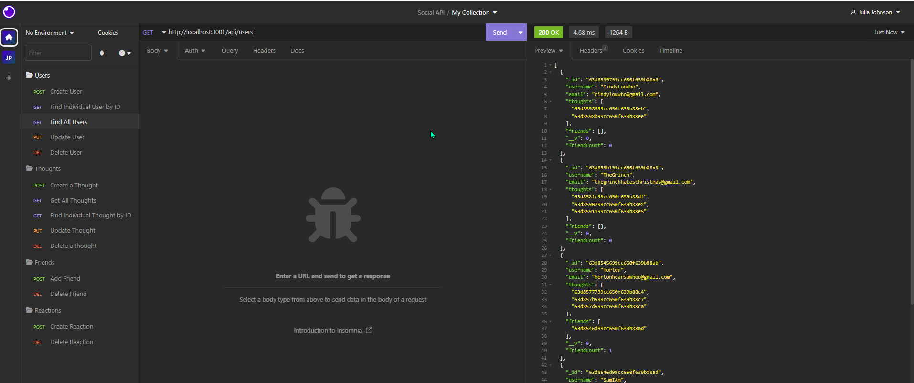

# Social Network API using NOSQL

## Table of Contents

- [User Story](#user)
- [Acceptance Criteria](#acceptance-critera)
- [Technology](#Technology)
- [Installation](#installation)
- [Usage](#usage)
- [Walkthrough Video](#Walkthrough-video)
- [Application Screenshot](#application-screenshot)
- [License](#license)
- [Contact](#contact)


## User Story
```
AS A social media startup
I WANT an API for my social network that uses a NoSQL database
SO THAT my website can handle large amounts of unstructured data
```

## Acceptance Critera
```
GIVEN a social network API
WHEN I enter the command to invoke the application
THEN my server is started and the Mongoose models are synced to the MongoDB database
WHEN I open API GET routes in Insomnia for users and thoughts
THEN the data for each of these routes is displayed in a formatted JSON
WHEN I test API POST, PUT, and DELETE routes in Insomnia
THEN I am able to successfully create, update, and delete users and thoughts in my database
WHEN I test API POST and DELETE routes in Insomnia
THEN I am able to successfully create and delete reactions to thoughts and add and remove friends to a user’s friend list
```

## Technology:

Project was created using:

- Javascript
- Node.js
- Express.js
- MongoDB
- Mongoose

## Installation

After cloning or forking the repo run on the CLI:

```
npm install
```

## Usage

Once everything has been installed, you can run by program by invoking:

```
npm start
```

## Walkthrough Video

[Click here for the walkthrough video demonstration](https://app.castify.com/view/c77c8050-cc50-4d07-a657-25f94de4481e)

## Application Screenshot



## License

[](https://opensource.org/licenses/MIT) <br>
This project is licensed under MIT

## Contact

For any questions, please contact me at jkjohnson673@gmail.com


